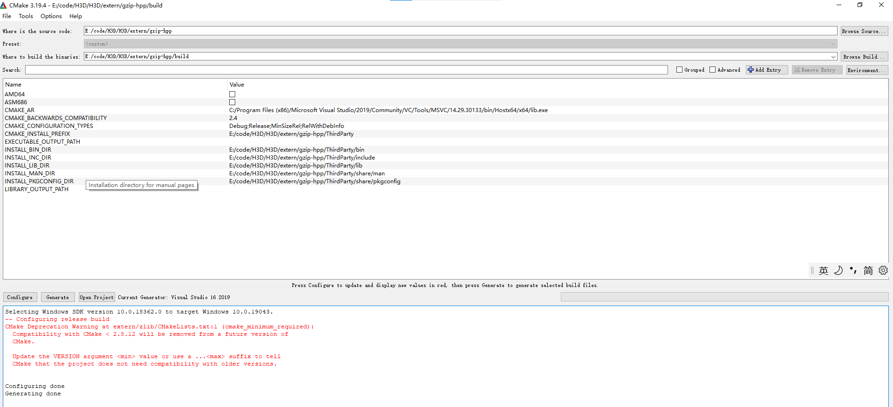
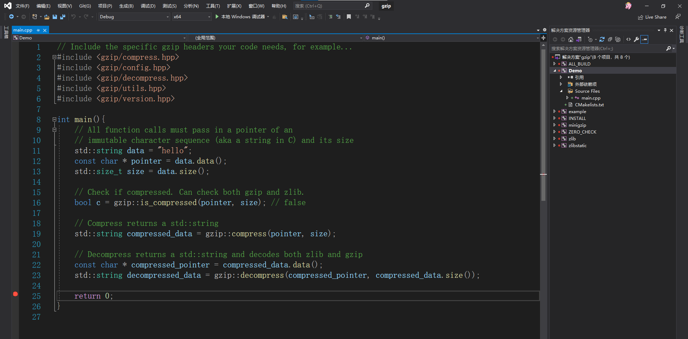

Gzip C++ lib for gzip compression and decompression. Extracted from [mapnik-vector-tile](https://github.com/mapbox/mapnik-vector-tile) for light-weight modularity.

[](https://travis-ci.com/mapbox/gzip-hpp)
[](https://github.com/mapbox/hpp-skel)

## Usage

`examples/main.cpp`

```c++
// Include the specific gzip headers your code needs, for example...
#include <gzip/compress.hpp>
#include <gzip/config.hpp>
#include <gzip/decompress.hpp>
#include <gzip/utils.hpp>
#include <gzip/version.hpp>

// All function calls must pass in a pointer of an 
// immutable character sequence (aka a string in C) and its size
std::string data = "hello";
const char * pointer = data.data();
std::size_t size = data.size();

// Check if compressed. Can check both gzip and zlib.
bool c = gzip::is_compressed(pointer, size); // false

// Compress returns a std::string
std::string compressed_data = gzip::compress(pointer, size);

// Decompress returns a std::string and decodes both zlib and gzip
const char * compressed_pointer = compressed_data.data();
std::string decompressed_data = gzip::decompress(compressed_pointer, compressed_data.size());

// Or like so
std::string compressed_data = gzip::compress(tile->data(), tile->data.size());

// Or like so
std::string value = gzip::compress(node::Buffer::Data(obj), node::Buffer::Length(obj));

// Or...etc

```
#### Compress
```c++
// Optionally include compression level
std::size_t size; // No default value, but what happens when not passed??
int level = Z_DEFAULT_COMPRESSION; // Z_DEFAULT_COMPRESSION is the default if no arg is passed

std::string compressed_data = gzip::compress(tile->data(), size, level);
```
#### Decompress
```c++
// No args other than the std:string
std::string data = "hello";
std::string compressed_data = gzip::compress(data);
const char * compressed_pointer = compressed_data.data();

std::string decompressed_data = gzip::decompress(compressed_pointer, compressed_data.size());

```
## Build



